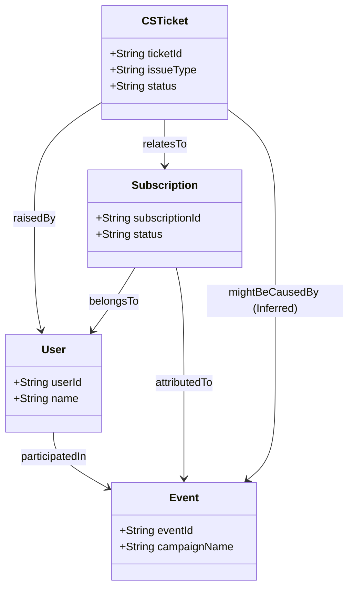

# CS 및 이벤트 도메인 통합 모델링 예제

이 예제는 이벤트(마케팅), 커머스(구독), CS(고객지원) 세 가지 도메인이 어떻게 유기적으로 연결되는지를 보여줍니다.

## 1. 클래스 다이어그램 (개념 모델)



## 2. 인스턴스 관계 모델링 (트리플 예시)

사용자 `User_Alice`가 `Event_BlackFriday`를 통해 유입되어 `Sub_Premium_001`을 구독하였고, 이후 환불을 위해 `Ticket_Refund_888`을 생성한 상황입니다.

### 인스턴스 선언
- `User_Alice` (타입: User)
- `Event_BlackFriday` (타입: Event)
- `Sub_Premium_001` (타입: Subscription)
- `Ticket_Refund_888` (타입: CSTicket)

### 관계 (Relations)
```text
User_Alice participatedIn Event_BlackFriday
Sub_Premium_001 belongsTo User_Alice
Sub_Premium_001 attributedTo Event_BlackFriday
Ticket_Refund_888 raisedBy User_Alice
Ticket_Refund_888 relatesTo Sub_Premium_001
```

## 3. 추론을 통한 인사이트 도출

명시된 데이터를 기반으로, 특정 이벤트가 환불 요청의 근본적인 원인인지 추론할 수 있습니다. 

**논리 규칙:**
티켓(T)이 구독(S)과 관련(`relatesTo`)되어 있고, 그 구독(S)이 특정 이벤트(E)의 기여(`attributedTo`)로 발생했으며, 티켓(T)의 유형이 'Refund'일 때, 티켓(T)은 이벤트(E)에 의해 기인했을 수 있다(`mightBeCausedBy`).

이를 통해 마케팅 부서는 `Event_BlackFriday` 캠페인의 실제 ROI(환불률을 고려한 순수익)를 정확하게 재평가할 수 있습니다.
