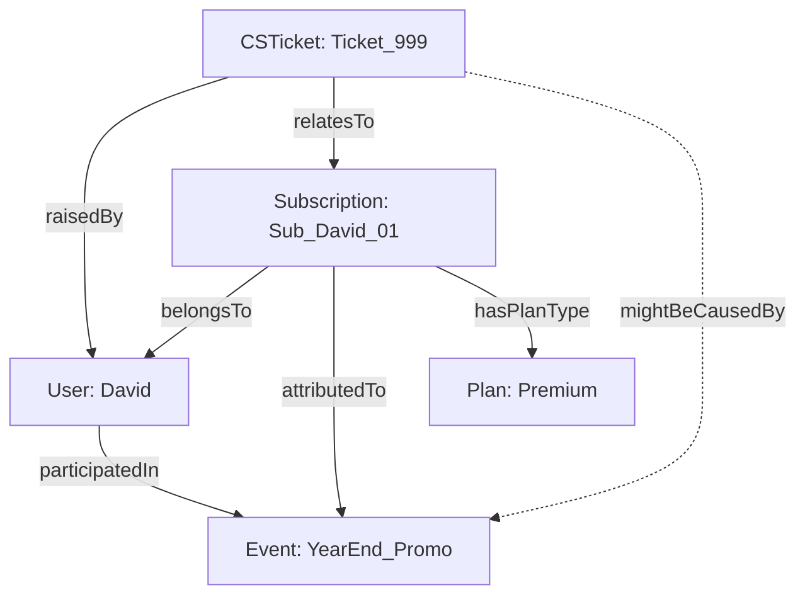

# 통합 시뮬레이션 시나리오 및 아키텍처 리뷰

이 문서는 Phase 2에서 설계한 전체 모델(마케팅, 커머스, CS)이 하나의 그래프로 작동하는 모습을 보여주는 종합 시뮬레이션입니다.

## 1. 종합 클래스 및 관계 아키텍처

## 2. 시뮬레이션 전개 (시간 순서)

1. **마케팅 유입 (T0):** `User_David`가 `YearEnd_Promo`를 통해 접속.
2. **구독 생성 (T1):** `Sub_David_01` (Premium Plan)을 결제. 상태는 `Active`.
3. **결제 실패 및 룰 실행 (T2):** 한 달 뒤, 카드 정지로 결제가 실패함.
   - **Rule Engine 동작:** `PaymentFailed` 이벤트를 감지하여, 구독 상태를 `GracePeriod`(유예)로 변경.
4. **고객 불만 접수 (T3):** David가 서비스 중단을 오해하여 환불을 요구하는 `Ticket_999`를 생성함.
5. **데이터 조회 (T4):** CS 상담원이 시스템을 조회함.
   - SPARQL 백엔드가 지식 그래프를 훑어, `Ticket_999` -> `Sub_David_01` -> `YearEnd_Promo` 로 이어지는 맥락을 실시간으로 화면에 띄워줌.

## 3. 확장성 시뮬레이션: '배송' 시스템 추가

회사가 프리미엄 구독자에게 '오프라인 잡지'를 매월 배송하기로 결정했습니다.
지식 그래프에서는 데이터베이스 마이그레이션 없이 다음만 추가하면 됩니다.

1. 클래스 추가: `Delivery`
2. 프로퍼티 추가: `hasDelivery` (Domain: Subscription, Range: Delivery)
3. 데이터 추가: `Sub_David_01 hasDelivery Delivery_D01`

기존의 결제, 마케팅, CS 쿼리는 아무런 수정 없이 그대로 작동하며, 새로운 비즈니스 룰("유예 상태인 구독의 배송은 일시 중지한다")만 가볍게 덧붙일 수 있습니다.
